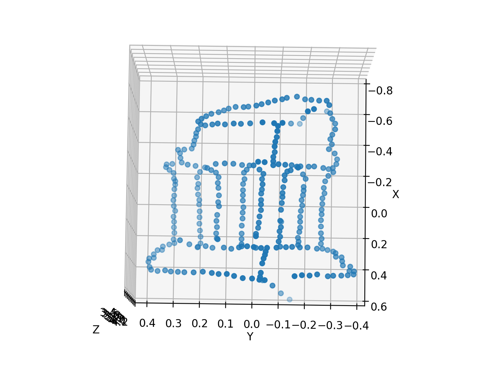

# 3D-Reconstruction
This task entails the following:
- Fundamental matrix estimation
- Metric Reconstruction
- 3D Visualization
- Bundle Adjustment

# Input Camera Image

# Point Cloud of 3D Reconstruction

